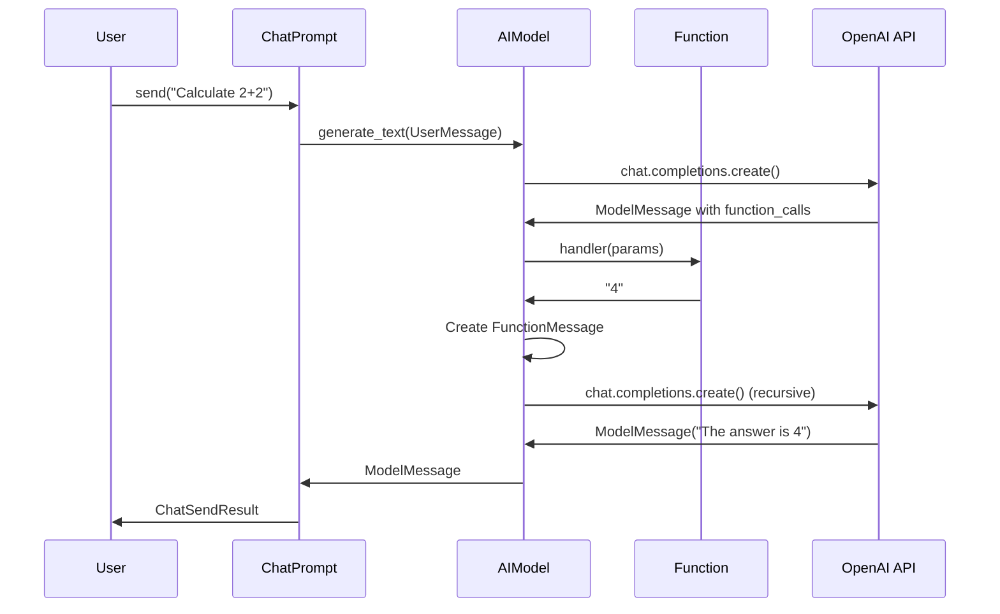
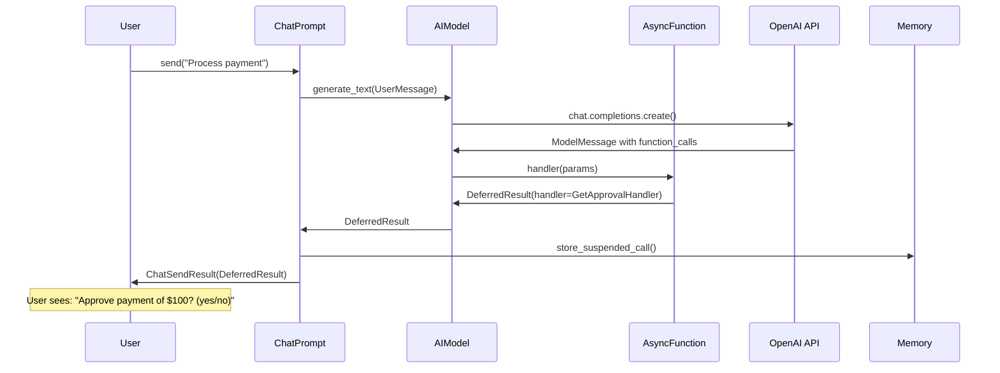
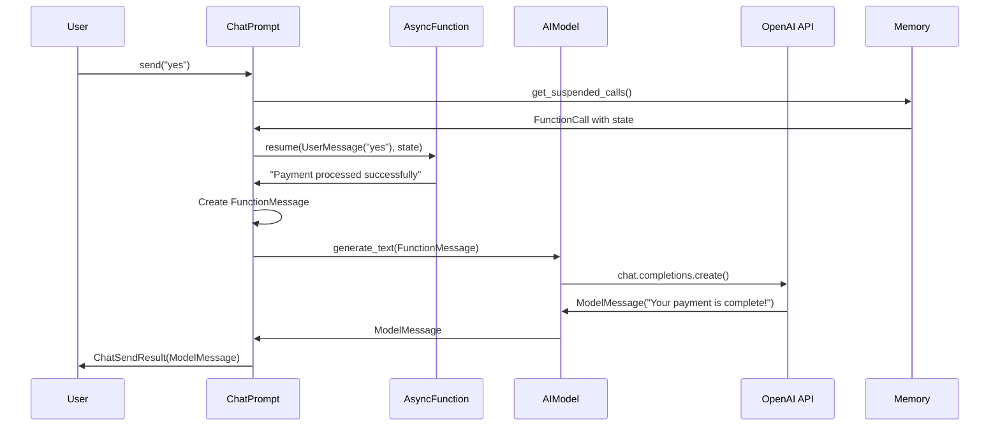

# AsyncFunction Design and Architecture

## Overview

This document outlines the design and implementation plan for AsyncFunction support in the Microsoft Teams Python SDK. AsyncFunctions enable functions to suspend execution, wait for external input (user responses, webhooks, timers), and resume seamlessly while maintaining conversation state.

## Core Concept

AsyncFunctions can **suspend** during execution and be **resumed** later with additional input. When a function suspends, it returns a `DeferredResult` containing:
- The suspension state (for later resume)
- A handler specifying what type of interaction is needed
- The current conversation pauses until external input is provided

## Architecture Overview

```mermaid
graph TD
    A[User Input] --> B[ChatPrompt.send()]
    B --> C{Suspended Functions?}
    C -->|Yes| D[Resume AsyncFunction]
    C -->|No| E[Normal Processing]
    
    D --> F[AsyncFunction.resume()]
    F --> G{Still Suspended?}
    G -->|Yes| H[Return DeferredResult]
    G -->|No| I[Create FunctionMessage]
    
    E --> J[AIModel.generate_text()]
    I --> J
    J --> K{Function Calls?}
    K -->|Yes| L[Execute Functions]
    K -->|No| M[Return ModelMessage]
    
    L --> N{DeferredResult?}
    N -->|Yes| O[Store Suspension State]
    N -->|No| P[Continue Recursively]
    
    O --> H
    P --> K
    H --> Q[Return to User]
    M --> Q
```

## Core Types and Interfaces

### 1. Handler Types

```python
from dataclasses import dataclass
from typing import Literal, Union

@dataclass
class AskUserHandler:
    type: Literal["ask_user"] = "ask_user"
    question: str

@dataclass  
class GetApprovalHandler:
    type: Literal["get_approval"] = "get_approval"
    prompt: str

@dataclass
class SelectFromOptionsHandler:
    type: Literal["select_options"] = "select_options"
    question: str
    options: list[str]

@dataclass
class WebhookHandler:
    type: Literal["webhook"] = "webhook"  
    webhook_url: str

@dataclass
class TimerHandler:
    type: Literal["timer"] = "timer"
    delay_seconds: int
    message: str

# Union of all handler types
DeferredHandler = Union[
    AskUserHandler, 
    GetApprovalHandler, 
    SelectFromOptionsHandler,
    WebhookHandler,
    TimerHandler
]
```

### 2. Generic DeferredResult

```python
from typing import TypeVar, Generic

THandler = TypeVar("THandler")
TResumer = TypeVar("TResumer") 

@dataclass
class DeferredResult(Generic[THandler, TResumer]):
    type: Literal["deferred"] = "deferred"
    state: dict[str, Any]
    handler: THandler

# Type aliases for common patterns
AskUserResult = DeferredResult[AskUserHandler, UserMessage]
GetApprovalResult = DeferredResult[GetApprovalHandler, UserMessage] 
WebhookResult = DeferredResult[WebhookHandler, dict[str, Any]]
TimerResult = DeferredResult[TimerHandler, None]

AnyDeferredResult = Union[
    AskUserResult,
    GetApprovalResult, 
    SelectFromOptionsHandler,
    WebhookResult,
    TimerResult
]
```

### 3. AsyncFunction Protocol

```python
class AsyncFunctionHandler(Protocol[Params]):
    def __call__(self, params: Params) -> Union[str, AnyDeferredResult]: ...
    def resume(self, resumer: Any, state: dict[str, Any]) -> Union[str, AnyDeferredResult]: ...

@dataclass
class AsyncFunction(Generic[Params]):
    name: str
    description: str  
    parameter_schema: Union[type[Params], Dict[str, Any]]
    handler: AsyncFunctionHandler[Params]
```

### 4. Extended FunctionCall

```python
@dataclass
class FunctionCall:
    id: str
    name: str
    arguments: dict[str, Any]
    # New async-specific fields:
    type: Literal["sync", "async"] | None = None
    status: Literal["running", "suspended", "completed", "failed"] | None = None
    state: dict[str, Any] | None = None
    handler: DeferredHandler | None = None
```

## Implementation Examples

### 1. Simple AskUser Function

```python
class ShoppingParams(BaseModel):
    items: list[str]
    budget: float

class ShoppingHandler:
    def __call__(self, params: ShoppingParams) -> AskUserResult:
        return DeferredResult[AskUserHandler, UserMessage](
            state={"items": params.items, "budget": params.budget},
            handler=AskUserHandler(question="What additional item would you like to add?")
        )
    
    def resume(self, user_message: UserMessage, state: dict[str, Any]) -> str:
        user_choice = user_message.content
        original_items = state["items"]
        return f"Adding '{user_choice}' to cart with {original_items}"

# Usage
shopping_function = AsyncFunction(
    name="add_to_cart",
    description="Add items to shopping cart",
    parameter_schema=ShoppingParams,
    handler=ShoppingHandler()
)
```

### 2. Multi-Step Approval Workflow

```python
class ApprovalParams(BaseModel):
    document: str
    amount: float

class DocumentApprovalHandler:
    def __call__(self, params: ApprovalParams) -> GetApprovalResult:
        return DeferredResult[GetApprovalHandler, UserMessage](
            state={
                "document": params.document, 
                "amount": params.amount,
                "step": "manager_approval"
            },
            handler=GetApprovalHandler(
                prompt=f"Manager approval needed for ${params.amount} expense: '{params.document}'"
            )
        )
    
    def resume(self, user_message: UserMessage, state: dict[str, Any]) -> Union[str, GetApprovalResult]:
        user_input = user_message.content.lower()
        
        if state["step"] == "manager_approval":
            if "yes" in user_input or "approve" in user_input:
                return DeferredResult[GetApprovalHandler, UserMessage](
                    state={**state, "step": "director_approval", "manager_approved": True},
                    handler=GetApprovalHandler(
                        prompt=f"Director approval needed for ${state['amount']} expense"
                    )
                )
            else:
                return f"Expense rejected by manager: {state['document']}"
        
        elif state["step"] == "director_approval":
            if "yes" in user_input or "approve" in user_input:
                return f"Expense '${state['amount']} - {state['document']}' fully approved!"
            else:
                return f"Expense rejected by director: {state['document']}"
```

## Data Flow Diagrams

### Normal Function Execution Flow



### AsyncFunction Suspension Flow



### AsyncFunction Resume Flow



## Resume Handler Patterns

AsyncFunction resume handling varies based on the type of interaction required:

### 1. **Structured Responses: Dedicated Handler Aliases**

For AsyncFunctions that expect structured data (cards, webhooks, specific payloads), the system generates dedicated handler aliases:

```python
# Generated handler aliases for structured responses
class TeamsApp(GeneratedActivityHandlerMixin):
    
    @on_expense_approval_response  # Alias for @on_card_action
    async def handle_approval(self, activity: AdaptiveCardInvokeActivity):
        """Handle approval card responses"""
        action = activity.value.get("action")  # "approve", "deny", "request_info"
        await self.resume_function("expense_approval", action)
    
    @on_payment_webhook_response  # Alias for @on_invoke
    async def handle_payment_webhook(self, activity: InvokeActivity):
        """Handle payment webhook callbacks"""
        webhook_data = activity.value
        await self.resume_function("payment_webhook", webhook_data)
    
    @on_menu_selection_response  # Alias for @on_card_action
    async def handle_menu_selection(self, activity: AdaptiveCardInvokeActivity):
        """Handle menu option selections"""
        selection = activity.value.get("selected_option")
        await self.resume_function("menu_selection", selection)
```

### 2. **Text Responses: Handle in `@on_message`**

For AsyncFunctions expecting text responses (human-in-the-loop, open-ended questions), developers handle resume logic in the generic `@on_message` handler:

```python
class TeamsApp(GeneratedActivityHandlerMixin):
    
    @on_message
    async def handle_all_text_messages(self, activity: MessageActivity):
        """Handle both normal chat AND AsyncFunction text responses"""
        
        # Strategy 1: Check for suspended HITL functions first
        if await self.has_suspended_hitl():
            await self.resume_hitl_function(activity.text)
            return
            
        # Strategy 2: Use heuristics to detect HITL responses
        if self.looks_like_hitl_response(activity.text):
            await self.try_resume_hitl(activity.text)
            return
            
        # Strategy 3: Normal conversation
        result = await self.chat.send(activity.text)
        await self.send_response(result)
    
    async def has_suspended_hitl(self) -> bool:
        """Check if any human-in-the-loop functions are suspended"""
        suspended = await self.get_suspended_functions(handler_type="ask_user")
        return len(suspended) > 0
    
    async def resume_hitl_function(self, user_text: str):
        """Resume suspended HITL function with user response"""
        suspended_hitl = await self.get_suspended_hitl_function()
        if suspended_hitl:
            result = await suspended_hitl.resume(UserMessage(content=user_text), suspended_hitl.state)
            await self.handle_resume_result(result)
```

### 3. **Handler Generation Strategy**

The system generates handler aliases based on AsyncFunction handler types:

```python
# Handler generation mapping
handler_mappings = {
    AskUserHandler: None,  # No alias - handle in @on_message
    GetApprovalHandler: ("on_{function_name}_response", "card.action", AdaptiveCardInvokeActivity),  
    WebhookHandler: ("on_{function_name}_webhook", "invoke", InvokeActivity),
    SelectFromOptionsHandler: ("on_{function_name}_selection", "card.action", AdaptiveCardInvokeActivity),
    TimerHandler: None,  # No handler needed - auto-resume
}

# Documentation generated for each AsyncFunction
"""
AsyncFunction Handler Requirements:

STRUCTURED RESPONSES (get dedicated handlers):
- GetApprovalHandler -> @on_{name}_response (AdaptiveCardInvokeActivity)
- WebhookHandler -> @on_{name}_webhook (InvokeActivity)  
- SelectFromOptionsHandler -> @on_{name}_selection (AdaptiveCardInvokeActivity)

TEXT RESPONSES (handled in @on_message):
- AskUserHandler -> Handle in @on_message with suspend/resume logic
- HumanInTheLoopHandler -> Handle in @on_message with suspend/resume logic

Example:

approval_function = AsyncFunction(name="expense_approval", handler=GetApprovalHandler())
# REQUIRES: @on_expense_approval_response

hitl_function = AsyncFunction(name="human_in_loop", handler=AskUserHandler()) 
# REQUIRES: Logic in @on_message to detect and resume HITL responses
"""
```

### 4. **Developer Resume Strategies**

Developers can choose different strategies for handling ambiguous text message routing:

**Strategy A: Suspend-First**
```python
@on_message
async def handle(self, activity):
    if await self.has_suspended_hitl():
        await self.resume_hitl(activity.text)
    else:
        await self.normal_chat(activity.text)
```

**Strategy B: Keyword Detection**
```python
@on_message  
async def handle(self, activity):
    if self.is_likely_hitl_response(activity.text):
        await self.try_resume_hitl(activity.text)
    else:
        await self.normal_chat(activity.text)
```

**Strategy C: Always Try HITL First**
```python
@on_message
async def handle(self, activity):
    if not await self.try_resume_hitl(activity.text):
        await self.normal_chat(activity.text)
```

## Integration Points

### 1. ChatPrompt Changes

```python
class ChatPrompt:
    def __init__(self, model: AIModel, *, functions: list[Union[Function[Any], AsyncFunction[Any]]] | None = None):
        # Support both Function and AsyncFunction types
        self.functions: dict[str, Union[Function[Any], AsyncFunction[Any]]] = {
            func.name: func for func in functions
        } if functions else {}

    async def send(self, input: str | Message, **kwargs) -> ChatSendResult:
        if isinstance(input, str):
            input = UserMessage(content=input)
        
        # Check for suspended functions
        suspended_calls = await memory.get_suspended_calls()
        
        if suspended_calls:
            return await self._resume_suspended_function(input, suspended_calls[0])
        else:
            return await self._process_new_message(input, **kwargs)

    async def _resume_suspended_function(self, user_input: UserMessage, call: FunctionCall) -> ChatSendResult:
        function = self.functions[call.name]
        
        # Resume the function
        result = function.resume(user_input, call.state)
        if inspect.isawaitable(result):
            result = await result
        
        if isinstance(result, DeferredResult):
            # Function suspended again
            await memory.store_suspended_call(call)
            return ChatSendResult(response=result)
        else:
            # Function completed - send result to LLM
            function_message = FunctionMessage(content=result, function_id=call.id)
            response = await self.model.generate_text(function_message, memory=memory, functions=self.functions)
            return ChatSendResult(response=response)
```

### 2. AIModel Protocol Update

```python
class AIModel(Protocol):
    async def generate_text(
        self,
        input: Message,
        *,
        system: SystemMessage | None = None,
        memory: Memory | None = None,
        functions: dict[str, Union[Function[BaseModel], AsyncFunction[BaseModel]]] | None = None,
        on_chunk: Callable[[str], Awaitable[None]] | None = None,
    ) -> Union[ModelMessage, AnyDeferredResult]:
        # Can return either completed ModelMessage OR suspension
        ...
```

### 3. OpenAI Model Changes

```python
async def generate_text(self, input, **kwargs) -> Union[ModelMessage, AnyDeferredResult]:
    function_results = await self._execute_functions(input, functions)
    
    # Check if any function suspended
    for result in function_results:
        if isinstance(result, DeferredResult):
            return result  # Return suspension immediately
    
    # No suspensions - continue with normal LLM call
    openai_messages = self._convert_messages(input, system, messages)
    response = await self._client.chat.completions.create(...)
    model_response = self._convert_response(response)
    
    if model_response.function_calls:
        return await self.generate_text(model_response, **kwargs)
    
    return model_response

async def _execute_functions(self, input: Message, functions) -> list[Union[FunctionMessage, DeferredResult]]:
    results = []
    
    if isinstance(input, ModelMessage) and input.function_calls:
        for call in input.function_calls:
            function = functions[call.name]
            parsed_args = parse_function_arguments(function, call.arguments)
            
            if isinstance(function, AsyncFunction):
                result = function.handler(parsed_args)
            else:
                result = function.handler(parsed_args)
            
            if inspect.isawaitable(result):
                result = await result
                
            if isinstance(result, DeferredResult):
                # Update call with suspension info
                call.type = "async"
                call.status = "suspended" 
                call.state = result.state
                call.handler = result.handler
                results.append(result)
                break  # Stop processing on suspension
            else:
                results.append(FunctionMessage(content=result, function_id=call.id))
    
    return results
```

### 4. Memory Extensions

```python
class Memory(Protocol):
    # Existing methods
    async def push(self, message: Message) -> None: ...
    async def get_all(self) -> list[Message]: ...
    
    # New methods for suspension
    async def store_suspended_call(self, call: FunctionCall) -> None: ...
    async def get_suspended_calls(self) -> list[FunctionCall]: ...
    async def clear_suspended_calls(self) -> None: ...

class ListMemory:
    def __init__(self):
        self._messages: list[Message] = []
        self._suspended_calls: list[FunctionCall] = []
    
    async def store_suspended_call(self, call: FunctionCall) -> None:
        self._suspended_calls.append(call)
    
    async def get_suspended_calls(self) -> list[FunctionCall]:
        return self._suspended_calls.copy()
    
    async def clear_suspended_calls(self) -> None:
        self._suspended_calls.clear()
```

## User Experience Examples

### Simple Interaction

```python
# Setup
chat = ChatPrompt(model=openai_model, functions=[shopping_function])

# Initial call suspends
result = await chat.send("Add something to my cart")
print(result.response.handler.question)  # "What additional item would you like to add?"

# Resume automatically
result = await chat.send("socks")
print(result.response.content)  # "I've added 'socks' to your cart with ['shoes', 'shirts']"
```

### Multi-Step Workflow

```python
# Step 1: Suspension
result = await chat.send("Submit my expense report")
print(result.response.handler.prompt)  # "Manager approval needed for $250 expense: 'Office supplies'"

# Step 2: Still suspended
result = await chat.send("approved")
print(result.response.handler.prompt)  # "Director approval needed for $250 expense"

# Step 3: Completion
result = await chat.send("approved")
print(result.response.content)  # "Expense 'Office supplies - $250' fully approved!"
```

## Implementation Plan: Human-in-the-Loop AsyncFunction

### Phase 1: Core Types (function.py)
1. Add AskUserHandler and DeferredResult types
2. Extend FunctionCall with async fields
3. Create AsyncFunction protocol and dataclass
4. Update imports and type variables

### Phase 2: Memory Support
5. Update Memory protocol with suspension methods
6. Implement ListMemory suspension support

### Phase 3: Model Integration
7. Update AIModel protocol return type
8. Modify OpenAI models _execute_functions for DeferredResult
9. Update ChatPrompt to handle DeferredResult and resume

### Phase 4: Testing
10. Create simple HITL test/example
11. Update __init__.py exports

## Key Files to Modify

- `packages/ai/src/microsoft/teams/ai/function.py` - Core types
- `packages/ai/src/microsoft/teams/ai/memory.py` - Memory protocol
- `packages/ai/src/microsoft/teams/ai/list_memory.py` - Memory implementation  
- `packages/ai/src/microsoft/teams/ai/ai_model.py` - AIModel protocol
- `packages/ai/src/microsoft/teams/ai/chat_prompt.py` - ChatPrompt logic
- `packages/openai/src/microsoft/teams/openai/completions_model.py` - OpenAI implementation
- `packages/openai/src/microsoft/teams/openai/responses_chat_model.py` - OpenAI implementation
- `packages/ai/src/microsoft/teams/ai/__init__.py` - Exports

## Backward Compatibility

- All existing `Function` objects continue working unchanged
- No breaking changes to existing function handlers
- ChatPrompt can mix both sync and async functions
- Models handle both types transparently
- Existing memory implementations work (new methods optional)

## Benefits

1. **Type Safety**: Generic DeferredResult ensures handler/resumer type matching
2. **Clean Separation**: ChatPrompt handles conversation flow, models handle execution
3. **Simple Integration**: Minimal changes to existing codebase
4. **Flexible**: Supports various interaction patterns (user input, webhooks, timers)
5. **Natural UX**: Users continue normal conversation flow during suspensions

---

## Appendix: Alternative Approaches Considered

### A1. Suspend Callback Approach

**Initial Design:**
```python
async def handler(params: AsyncParams[T], suspend: SuspendCallback) -> str:
    if params.type == "init":
        suspend(state_data)
    elif params.type == "resumed":
        # Handle resume
```

**Issues:**
- Complex AsyncParams type trying to handle both init and resume data
- Different data shapes (structured params vs simple user responses) 
- Magic suspend callback felt indirect
- Harder to follow workflow logic across init/resume

### A2. String-Based Handlers

**Alternative Design:**
```python
@dataclass
class DeferredResult:
    state: dict[str, Any]
    handler: str  # "AskUser", "GetApproval"
    output: str   # Display text
```

**Issues:**
- No type safety for handler types
- String typos ("AskUer" vs "AskUser")
- No IDE autocomplete support
- Hard to extend with new handler types

### A3. Complex Recursion Control

**Alternative Design:**
```python
async def generate_text(...) -> ModelMessage:
    function_results, has_suspended = await self._execute_functions(...)
    
    if model_response.function_calls and not has_suspended:
        return await self.generate_text(...)  # Only recurse if no suspensions
```

**Issues:**
- Complex state tracking in models
- Need to modify ModelMessage structure
- Suspension state scattered across multiple places
- Harder to reason about control flow

### A4. Explicit Resume API

**Alternative Design:**
```python
# Suspend
result = await chat.send("Process payment")

# Explicit resume method
resume_result = await chat.resume("yes, I approve")
```

**Issues:**
- Two different APIs for users to learn
- More complex state management
- Less natural conversation flow
- Users need to understand suspend/resume mechanics

### A5. Models Return Complex Union Types

**Alternative Design:**
```python
async def generate_text(...) -> Union[ModelMessage, DeferredResult, SuspendedState]:
    # Multiple return types based on execution state
```

**Issues:**
- Complex type handling throughout system
- Unclear which type to expect when
- More difficult error handling
- Harder to extend with new states

---

## Conclusion

The chosen design balances simplicity, type safety, and clean integration. The generic DeferredResult approach provides strong typing while the simplified resume flow (AsyncFunction.resume → FunctionMessage → LLM) keeps the implementation straightforward and maintainable.