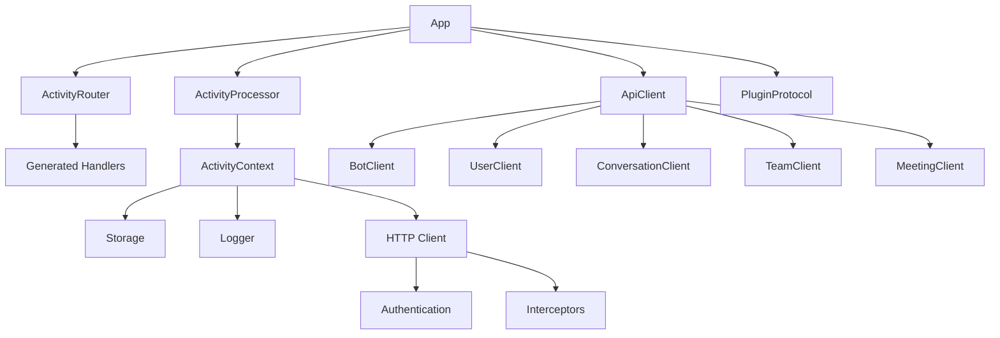

# Microsoft Teams Python SDK - Comprehensive Analysis

## Executive Summary

The Microsoft Teams Python SDK (`teams.py`) is a modern, developer-focused framework for building Microsoft Teams applications. The SDK demonstrates exceptional engineering practices through its modular architecture, type-safe design, code generation patterns, and comprehensive developer experience features. This analysis reveals a well-structured codebase that prioritizes developer productivity, maintainability, and Teams platform integration.

## Architecture Overview

### High-Level Structure

The SDK follows a clean, modular architecture organized into four core packages:

```
teams.py/
├── packages/
│   ├── api/          # Core API models, clients, and Teams abstractions
│   ├── app/          # Application framework with routing and lifecycle
│   ├── cards/        # Adaptive Cards integration
│   └── common/       # Shared utilities (HTTP, logging, storage, events)
├── tests/            # Example applications and integration tests
└── scripts/          # Development and build automation
```

### Core Components & Relationships



## Key Architectural Patterns

### 1. Modular Package Design

**Pattern**: Clean separation of concerns across packages
- **`api`**: Pure API models and client implementations
- **`app`**: Framework logic and application lifecycle 
- **`common`**: Reusable utilities with no Teams-specific logic
- **`cards`**: Adaptive Cards integration layer

**Benefits**: 
- Clear dependency boundaries
- Independent development and testing
- Selective import of needed functionality

### 2. Code Generation for Type Safety

**Implementation**: `packages/app/scripts/generate_handlers.py`

The SDK uses sophisticated code generation to create type-safe activity handlers:

```python
# Generated code provides full IntelliSense and type checking
@app.on_message
async def handle_message(ctx: ActivityContext[MessageActivity]):
    # ctx is fully typed with MessageActivity-specific properties
    await ctx.reply(f"You said: {ctx.activity.text}")

@app.on_card_action  
async def handle_card(ctx: ActivityContext[AdaptiveCardInvokeActivity]) -> AdaptiveCardInvokeResponse:
    # Return type is enforced at compile time
    return AdaptiveCardInvokeResponse(...)
```

**Benefits**:
- Eliminates runtime type errors
- Provides excellent IDE support
- Ensures API consistency across 40+ activity types
- Reduces boilerplate code

### 3. Middleware Chain Architecture

**Pattern**: Express.js-inspired middleware for request processing

```python
class ActivityProcessor:
    async def execute_middleware_chain(self, ctx, handlers):
        # Middleware can call ctx.next() to continue the chain
        # Supports early termination and response capture
```

**Benefits**:
- Flexible request processing pipeline
- Easy to add cross-cutting concerns (auth, logging, validation)
- Composable behavior modification

### 4. Plugin Architecture

**Pattern**: Protocol-based extensibility

```python
class PluginProtocol(Protocol):
    async def on_start(self, port: int) -> None: ...
    async def on_stop(self) -> None: ...
    def on_error(self, error: Exception, activity_id: Optional[str] = None) -> None: ...
```

**Benefits**:
- Clean extension points
- Lifecycle management integration
- Type-safe plugin development

## Developer Experience Excellence

### 1. Modern Python Practices

**Type Safety**:
- Comprehensive type hints throughout codebase
- Generic types for storage and HTTP clients
- Protocol-based interfaces for extensibility

**Async/Await First**:
- All I/O operations are async
- Proper async context management
- Async event emitters with graceful error handling

**Modern Tooling**:
- `uv` for fast dependency management
- Ruff for linting and formatting
- Pyright for type checking
- Pre-commit hooks for code quality

### 2. Intuitive API Design

**Decorator-Based Handlers**:
```python
@app.on_message
async def handle_message(ctx: ActivityContext[MessageActivity]):
    if "help" in ctx.activity.text.lower():
        await ctx.reply("Here's how I can help...")

@app.event("sign_in")
async def handle_sign_in(event: SignInEvent):
    await event.activity_ctx.send("Welcome! You're now signed in.")
```

**Fluent Context API**:
```python
# Rich context with chainable operations
await ctx.send("Hello!")
await ctx.reply("This is a reply")  # Automatically quotes original message
await ctx.sign_in()  # Built-in OAuth flow handling
```

### 3. Comprehensive Error Handling

**Structured Error Types**:
```python
class HttpError(CustomBaseModel):
    code: str
    message: str
    inner_http_error: InnerHttpError
```

**Graceful Degradation**:
- HTTP client wraps JSON parsing with graceful fallbacks
- Event emitters continue execution even if handlers fail
- Comprehensive logging throughout the stack

### 4. Built-in Development Tools

**Rich Logging System**:
- ANSI color-coded console output
- Structured logging with JSON support
- Configurable log levels per component

**Mock Infrastructure**:
- Comprehensive test fixtures with realistic Teams API mocking
- Integration test configuration with skip patterns
- HTTP transport mocking for offline development

## Key Innovations

### 1. Activity Type System

**Problem Solved**: Teams has 40+ different activity types with different payload structures and response requirements.

**Solution**: Sophisticated type mapping system with code generation:

```python
# activity_route_configs.py defines mappings
ACTIVITY_ROUTES = {
    "message": ActivityConfig(
        method_name="on_message",
        input_model=MessageActivity,
        selector=lambda a: a.type == "message",
        name="message"
    ),
    "card.action": ActivityConfig(
        method_name="on_card_action", 
        input_model=AdaptiveCardInvokeActivity,
        output_model=AdaptiveCardInvokeResponse,
        selector=lambda a: a.type == "invoke" and a.name == "adaptiveCard/action",
        name="card.action"
    )
}
```

### 2. Context-Aware Authentication

**OAuth Integration**:
```python
# Automatic OAuth flow handling
async def handle_message(ctx: ActivityContext[MessageActivity]):
    if ctx.is_signed_in:
        # User already authenticated
        await process_authenticated_request(ctx)
    else:
        # Automatically send OAuth card
        await cfg.sign_in()
```

**JWT Validation**:
- Bot Framework token validation with proper JWKS handling
- Service URL validation for security
- Automatic token refresh lifecycle

### 3. Storage Abstraction

**Generic Storage Interface**:
```python
class Storage(Generic[K, V], ABC):
    def get(self, key: K) -> Optional[V]: ...
    async def async_get(self, key: K) -> Optional[V]: ...
    # Both sync and async variants for all operations
```

**Benefits**:
- Pluggable storage backends
- Both sync and async support
- Type-safe key-value operations

## Testing Strategy

### 1. Comprehensive Test Organization

**Test Structure**:
- **Unit Tests**: Fast, isolated tests with mocks (`pytest.mark.unit`)
- **Integration Tests**: Full API integration (`pytest.mark.integration`)  
- **Example Apps**: Echo bot and OAuth bot for end-to-end validation

### 2. Mock Infrastructure

**Realistic API Mocking**:
```python
@pytest.fixture
def mock_transport():
    """Comprehensive Teams API mocking with realistic responses"""
    # Handles 20+ different API endpoints with proper response structures
```

**Benefits**:
- Fast test execution
- Predictable test environment
- Comprehensive scenario coverage

### 3. Quality Assurance

**Automated Quality Gates**:
- Pre-commit hooks with Ruff formatting
- Type checking with Pyright
- Linting with extensive rule set
- Automatic code generation validation

## Configuration and Extensibility

### 1. Flexible Configuration

**Environment-First Configuration**:
```python
@dataclass
class AppOptions:
    client_id: Optional[str] = None          # From CLIENT_ID env var
    client_secret: Optional[str] = None      # From CLIENT_SECRET env var
    tenant_id: Optional[str] = None          # From TENANT_ID env var
    logger: Optional[Logger] = None          # Custom logger injection
    storage: Optional[Storage] = None        # Custom storage backend
    plugins: List[PluginProtocol] = []       # Plugin system
```

### 2. HTTP Client Extensibility

**Interceptor Pattern**:
```python
class LoggingInterceptor(Interceptor):
    def request(self, ctx: InterceptorRequestContext):
        ctx.logger.info(f"Making request to {ctx.request.url}")
        
    def response(self, ctx: InterceptorResponseContext):
        ctx.logger.info(f"Response: {ctx.response.status_code}")

client.use_interceptor(LoggingInterceptor())
```

### 3. Event System

**Type-Safe Event Emitters**:
```python
@app.event("activity")
async def log_all_activities(event: ActivityEvent):
    logger.info(f"Activity received: {event.activity.type}")

@app.event("error") 
async def handle_errors(event: ErrorEvent):
    # Automatic error context capture
    logger.error(f"Error in {event.context}: {event.error}")
```

## Best Practices Observed

### 1. Code Organization

- **Single Responsibility**: Each module has a clear, focused purpose
- **Dependency Injection**: Configurable dependencies throughout
- **Interface Segregation**: Small, focused protocols and abstract base classes
- **DRY Principle**: Code generation eliminates repetitive handler definitions

### 2. Error Handling

- **Explicit Error Types**: Structured error models with rich context
- **Graceful Degradation**: System continues operating when non-critical components fail
- **Comprehensive Logging**: Detailed error context for debugging
- **Early Validation**: Type checking and runtime validation prevent errors

### 3. Performance Considerations

- **Async by Default**: All I/O operations are non-blocking
- **Connection Pooling**: HTTP client reuses connections
- **Token Caching**: JWT tokens cached with automatic refresh
- **Lazy Loading**: Components initialized only when needed

### 4. Security

- **JWT Validation**: Proper Bot Framework token validation
- **Service URL Verification**: Prevents token replay attacks
- **Environment Variable Configuration**: Sensitive data not in code
- **Type Safety**: Prevents injection and parsing vulnerabilities

## Developer Onboarding Guide

### 1. Getting Started

**Prerequisites**:
```bash
# Install uv (modern Python package manager)
curl -LsSf https://astral.sh/uv/install.sh | sh

# Clone and setup
git clone <repository>
cd teams.py
uv sync --all-packages --group dev
source .venv/bin/activate  # Linux/Mac
# .venv\Scripts\Activate   # Windows
pre-commit install
```

**First Application**:
```python
from microsoft.teams.app import App
from microsoft.teams.api import MessageActivity

app = App()

@app.on_message
async def echo_handler(ctx):
    await ctx.reply(f"You said: {ctx.activity.text}")

if __name__ == "__main__":
    import asyncio
    asyncio.run(app.start())
```

### 2. Core Concepts

**Activity Context**: Your primary interface for handling Teams interactions
- `ctx.activity`: The incoming activity (typed based on handler)
- `ctx.send()`: Send new message to conversation
- `ctx.reply()`: Reply to current message (with quote)
- `ctx.sign_in()`: Initiate OAuth flow
- `ctx.storage`: Persistent storage interface

**Event System**: Handle application lifecycle and errors
```python
@app.event("start")
async def on_startup(event):
    print(f"Bot started on port {event.port}")

@app.event("error")
async def on_error(event):
    print(f"Error: {event.error}")
```

### 3. Common Patterns

**Message Handling**:
```python
@app.on_message
async def handle_message(ctx: ActivityContext[MessageActivity]):
    text = ctx.activity.text.lower()
    
    if "help" in text:
        await ctx.reply("Available commands: help, status, settings")
    elif "status" in text:
        await ctx.send("Bot is running!")
    else:
        await ctx.reply("I don't understand that command.")
```

**Card Interactions**:
```python
@app.on_card_action
async def handle_card_action(ctx: ActivityContext[AdaptiveCardInvokeActivity]) -> AdaptiveCardInvokeResponse:
    action_data = ctx.activity.value
    # Process card action
    return AdaptiveCardInvokeResponse(...)
```

**OAuth Integration**:
```python
@app.on_message
async def protected_action(ctx: ActivityContext[MessageActivity]):
    if not ctx.is_signed_in:
        await ctx.sign_in()
        return
    
    # User is authenticated, proceed with protected action
    await ctx.send("Processing your authenticated request...")
```

### 4. Development Workflow

**Code Quality**:
```bash
poe check    # Run linting and formatting
poe test     # Run test suite
poe fmt      # Format code
```

**Adding New Handlers**:
1. Use `@app.on_*` decorators for automatic type safety
2. Check `activity_route_configs.py` for available handler types
3. Run code generation if adding new activity types: `python scripts/generate_handlers.py`

**Testing**:
```python
@pytest.mark.unit
def test_message_handler():
    # Use provided fixtures for mocking
    pass

@pytest.mark.integration
def test_real_api():
    # Requires environment variables for real API testing
    pass
```

### 5. Advanced Topics

**Custom Plugins**:
```python
class MetricsPlugin:
    async def on_start(self, port: int):
        self.metrics_server = start_metrics_server()
    
    def on_activity_response(self, activity_id: str, response_data):
        self.metrics.increment("activities_processed")

app = App(AppOptions(plugins=[MetricsPlugin()]))
```

**Custom Storage**:
```python
class RedisStorage(Storage[str, Any]):
    def __init__(self, redis_client):
        self.redis = redis_client
    
    async def async_get(self, key: str) -> Optional[Any]:
        return await self.redis.get(key)
    
    async def async_set(self, key: str, value: Any) -> None:
        await self.redis.set(key, value)

app = App(AppOptions(storage=RedisStorage(redis_client)))
```

## Conclusion

The Microsoft Teams Python SDK represents a masterclass in modern Python framework design. Its key strengths include:

1. **Developer Experience**: Exceptional type safety, intuitive APIs, and comprehensive tooling
2. **Architecture**: Clean modular design with proper separation of concerns
3. **Extensibility**: Well-designed plugin system and configuration options
4. **Quality**: Comprehensive testing, automated code generation, and robust error handling
5. **Innovation**: Creative solutions to Teams platform complexity through code generation and type mapping

The SDK successfully abstracts the complexity of Teams development while providing powerful extension points for advanced use cases. It serves as an excellent example of how to build developer-focused frameworks that prioritize both usability and maintainability.

For teams building on Microsoft Teams, this SDK provides a solid foundation that grows with application complexity while maintaining developer productivity throughout the development lifecycle.