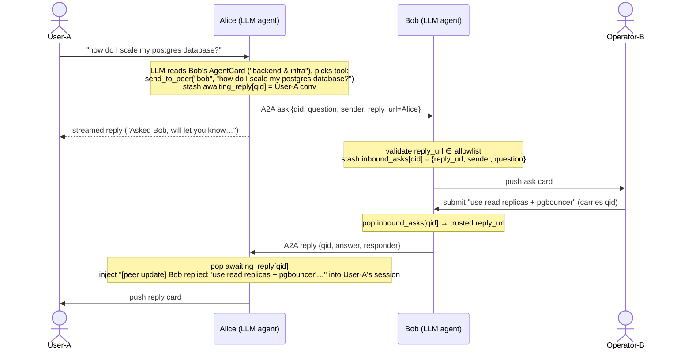

# Sample: Two Teams bots relaying questions via A2A + Adaptive Cards

Two symmetric Teams bots, each backed by an LLM. The user sends a natural-language message; the LLM decides whether to answer directly or forward the question to the other bot over A2A. The routing decision is driven by each peer's **A2A AgentCard description**, fetched lazily via `A2ACardResolver`. The peer's human operator fills in an Adaptive Card; the answer comes back over A2A and is folded into both a reply card and the user's chat session.

## Flow



## Files

- **Bot A / Alice** (`src/bot_a.py`) — Teams on **3978**, A2A on **5000**. Edit the `DESCRIPTION` constant to set Alice's expertise; this becomes her A2A AgentCard description that Bob's LLM reads to decide when to forward.
- **Bot B / Bob** (`src/bot_b.py`) — Teams on **3979**, A2A on **5001**. Same `DESCRIPTION` knob for Bob.
- **Shared**
  - `src/agent.py` — `BotAgent` holds the `agent_framework` `Agent`, lazily fetches peer A2A cards via `A2ACardResolver`, and exposes `get_agent()`, `session_for(conv_id)`, and `record_peer_reply(...)` for the bot file to use.
  - `src/state.py` — `BotState` (operator conversation, outbound asks awaiting a reply, inbound asks awaiting an operator).
  - `src/messages.py` — `AskMessage` / `ReplyMessage` Pydantic models with a `kind` discriminator.
  - `src/a2a_executor.py` — A2A server dispatch: `ask` → validate `reply_url`, stash, push card to operator; `reply` → push card to the original user and call `on_peer_reply`.
  - `src/a2a_server.py` — `make_a2a_app(..., allowed_peer_urls=..., on_peer_reply=...)` wraps the executor in `A2AStarletteApplication`.
  - `src/a2a_client.py` — `send_a2a(peer_url, data)` one-shot sender, plus `is_allowed_peer(url, allowed)` for origin-based peer URL validation.
  - `src/cards.py` — `ask_card(sender, question, qid)` (submit carries only qid), `reply_card(...)`.

## Operator model

Each bot remembers the last **1:1** Teams conversation that messaged it (`state.operator_conv_id`). Incoming asks are pushed into that conversation. 

## Peer authorization

The `reply_url` check in `is_allowed_peer` is a **demo-only** stand-in for authorization: a peer is trusted because its URL matches a configured origin. Production A2A should verify the caller's identity with a bearer token signed by an IdP or mTLS, not a self-declared URL.

## Configuration

Create `.env` in `examples/a2a-test/`:

```dotenv
# Shared — your Microsoft tenant
TENANT_ID=<your-tenant-id>

# Azure OpenAI — used by both bots' LLM
AZURE_OPENAI_API_KEY=<key>
AZURE_OPENAI_ENDPOINT=<endpoint>
AZURE_OPENAI_MODEL=<deployment-name>

# Bot A (Alice) — Teams app registration
BOT_A_CLIENT_ID=<alice-client-id>
BOT_A_CLIENT_SECRET=<alice-client-secret>

# Bot B (Bob) — Teams app registration
BOT_B_CLIENT_ID=<bob-client-id>
BOT_B_CLIENT_SECRET=<bob-client-secret>

# Optional — ports and A2A peer URLs (defaults shown)
# BOT_A_PORT=3978
# BOT_A_A2A_HOST=localhost
# BOT_A_A2A_PORT=5000
# BOB_A2A_URL=http://localhost:5001/
# BOT_B_PORT=3979
# BOT_B_A2A_HOST=localhost
# BOT_B_A2A_PORT=5001
# ALICE_A2A_URL=http://localhost:5000/
```

Each bot needs its **own** Teams app registration so DMs route to the right bot. If any `BOT_X_CLIENT_*` is empty, the bot falls back to the generic `CLIENT_ID` / `CLIENT_SECRET` — fine for devtools, but Teams can only route DMs to one bot at a time.

## Run

Two terminals from `examples/a2a-test/`:

```bash
uv run python src/bot_a.py   # Alice — Teams 3978, A2A 5000
uv run python src/bot_b.py   # Bob   — Teams 3979, A2A 5001
```

> ⚠ **DM each bot once before relaying.** The operator's conversation id is captured from the first Teams message the bot receives. If a peer ask arrives before its target has been DM'd, the target will log `no operator conversation; ask not pushed` and the card won't appear anywhere.