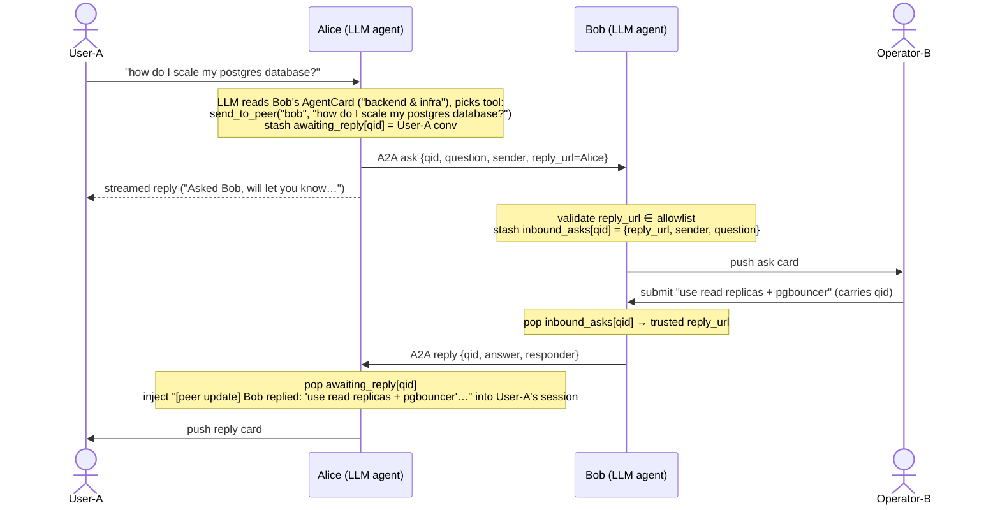

# Sample: Two Teams bots relaying questions via A2A + Adaptive Cards

Two symmetric Teams bots, Alice and Bob, each backed by an LLM agent. The user DMs one of them; the LLM decides whether to answer directly or forward the question to the other bot over the A2A protocol.

This sample demonstrates:

- **LLM-driven peer routing** — each bot's agent reads the other's A2A `AgentCard.description` (fetched lazily via `A2ACardResolver`) and uses that to decide whether to forward.
- **Human-in-the-loop via Adaptive Cards** — when a peer asks, the answering bot pushes an ask-card to its human operator's 1:1; the operator types a reply and submits.
- **Async reply, folded back into chat** — the answer comes back over A2A and is delivered both as a reply card and as a `[peer update]` note injected into the user's LLM session, so the next turn's model sees it as context.

## Flow



## Files

**Entry points** — start here.
- `src/bot_a.py` — Alice. Teams `/api/messages` and A2A `/a2a` share port **3978**. Edit the `DESCRIPTION` constant to set Alice's expertise; this becomes her A2A AgentCard description that Bob's LLM reads to decide when to forward.
- `src/bot_b.py` — Bob. Same layout on port **3979**. Same `DESCRIPTION` knob for Bob.

**LLM agent**
- `src/agent.py` — `BotAgent` builds the `agent_framework` `Agent`, lazily fetches peer A2A cards via `A2ACardResolver`, and exposes `get_agent()`, `session_for(conv_id)`, and `record_peer_reply(...)` for the bot file to use.

**A2A layer**
- `src/a2a_executor.py` — A2A server dispatch: `ask` → validate `reply_url`, stash, push card to operator; `reply` → push card to the original user and call `on_peer_reply`.
- `src/a2a_server.py` — `make_a2a_app(..., allowed_peer_urls=..., on_peer_reply=...)` wraps the executor in `A2AStarletteApplication`.
- `src/a2a_client.py` — `send_a2a(peer_url, data)` one-shot sender, plus `is_allowed_peer(url, allowed)` for origin-based peer URL validation.
- `src/messages.py` — `AskMessage` / `ReplyMessage` Pydantic models with a `kind` discriminator.

**Cards & state**
- `src/cards.py` — `ask_card(sender, question, qid)` (submit carries only qid), `reply_card(...)`.
- `src/state.py` — `BotState` (operator conversation, outbound asks awaiting a reply, inbound asks awaiting an operator).

## Operator model

Each bot remembers the last **1:1** Teams conversation that messaged it (`state.operator_conv_id`). Incoming asks are pushed into that conversation.

## Peer authorization

The `reply_url` check in `is_allowed_peer` is a **demo-only** stand-in for authorization: a peer is trusted because its URL matches a configured origin. Production A2A should verify the caller's identity with a bearer token signed by an IdP or mTLS, not a self-declared URL.

## Configuration

Create `.env` in `examples/a2a-test/`:

```dotenv
# Shared — your Microsoft tenant
TENANT_ID=<your-tenant-id>

# Azure OpenAI — used by both bots' LLM
AZURE_OPENAI_API_KEY=<key>
AZURE_OPENAI_ENDPOINT=<endpoint>
AZURE_OPENAI_MODEL=<deployment-name>

# Bot A (Alice) — Teams app registration
BOT_A_CLIENT_ID=<alice-client-id>
BOT_A_CLIENT_SECRET=<alice-client-secret>

# Bot B (Bob) — Teams app registration
BOT_B_CLIENT_ID=<bob-client-id>
BOT_B_CLIENT_SECRET=<bob-client-secret>

# Optional — ports and A2A peer URLs (defaults shown)
# BOT_A_HOST=localhost
# BOT_A_PORT=3978
# BOB_A2A_URL=http://localhost:3979/a2a/
# BOT_B_HOST=localhost
# BOT_B_PORT=3979
# ALICE_A2A_URL=http://localhost:3978/a2a/
```

Each bot needs its **own** Teams app registration so DMs route to the right bot.

## Run

Two terminals from `examples/a2a-test/`:

```bash
uv run python src/bot_a.py   # Alice — Teams + A2A on 3978
uv run python src/bot_b.py   # Bob   — Teams + A2A on 3979
```

> ⚠ **DM each bot once before relaying.** The operator's conversation id is captured from the first Teams message the bot receives. If a peer ask arrives before its target has been DM'd, the target will log `no operator conversation; ask not pushed` and the card won't appear anywhere.

### Try it

With both bots DM'd at least once, try this transcript against Alice:

```
You → Alice: how do I scale my postgres database?
Alice → You: Asked Bob, will let you know…
   (Bob's operator gets an ask card, types "use read replicas + pgbouncer", submits)
Alice → You: [reply card] Bob says: use read replicas + pgbouncer
You → Alice: thanks — and what about caching?
Alice → You: Bob suggested read replicas + pgbouncer earlier; for caching you'd typically add Redis in front…
```

The bots are symmetric — DM Bob with a UX question and the same flow runs the other way (Bob's LLM forwards to Alice).
