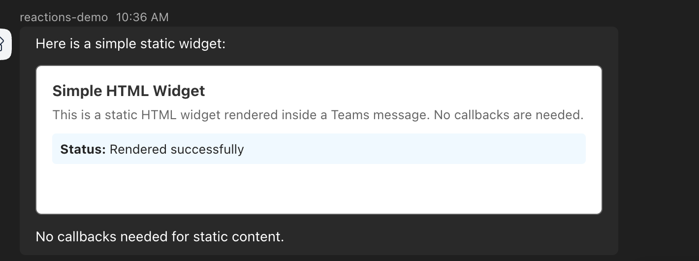
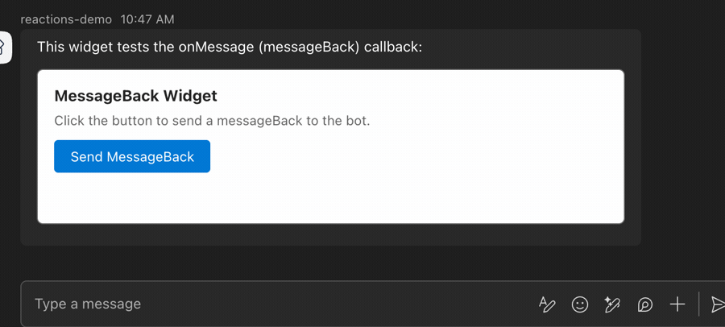
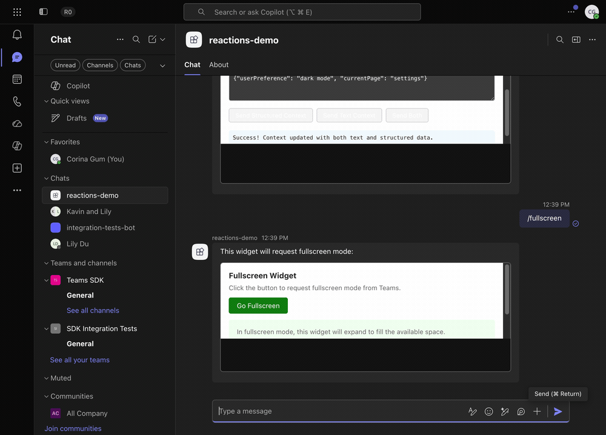

# HTML Widgets Example

This example demonstrates the full HTML widget capabilities for Teams bots using the Python SDK.

## Demo

The bot renders several HTML widgets in Teams.
Each command below maps to a widget that exercises part of the widget contract.

### Static rendering (`/simple`)

A static widget renders directly from markdown with no callbacks.



### messageBack round-trip (`/messageback`)

Clicking the widget button sends a `messageBack` to the bot, which echoes the received value.



### Update model context (`/context`)

The widget sends structured and text context to the model using `ui/update-model-context`.


### Fullscreen display mode (`/fullscreen`)

The widget requests fullscreen mode from Teams and expands to fill the available space.



### Payload validation (`/validate`)

The SDK validates the widget payload before sending and reports policy warnings.


### Host context inspection (`/hostcontext`)

The widget reads the `hostContext` from the `ui/initialize` response.


## Commands

| Command | Description |
|---------|-------------|
| `/simple` | Static widget (no callbacks) |
| `/calltool` | Widget with onCallTool (tools/call) |
| `/messageback` | Widget with onMessage (messageBack) |
| `/fullscreen` | Widget requesting fullscreen display mode |
| `/multi` | Widget with multiple tools (getTime, roll, echo) |
| `/openlink` | Widget with ui/open-link |
| `/context` | Widget with ui/update-model-context |
| `/hostcontext` | Inspect hostContext from ui/initialize |
| `/validate` | Security policy validation demo |
| `/help` | List available commands |

## Architecture

```
src/
  main.py           # Bot entry point, command routing, callTool handler
  widgets/
    __init__.py     # Re-exports all widget HTML constants
    simple.py       # Static widget HTML
    calltool.py     # CallTool interactive widget HTML
    fullscreen.py   # Fullscreen request widget HTML
    messageback.py  # MessageBack widget HTML
    multi_tool.py   # Multi-tool dispatch widget HTML
    open_link.py    # Open link widget HTML
    update_context.py  # Update model context widget HTML
    host_context.py # Host context inspector widget HTML
```

## Running

```bash
# From the repo root
cd examples/html-widgets
cp ../../.env .env  # Or create .env with CLIENT_ID, CLIENT_SECRET, TENANT_ID

# Install dependencies (uses workspace)
uv sync

# Start the bot
uv run python src/main.py
```

## Widget Response Format

The `on_widget_call_tool` handler returns an `HtmlWidgetCallToolResponse`:

```python
@app.on_widget_call_tool
async def handle(ctx):
    return HtmlWidgetCallToolResponse(
        response_type="htmlwidget/calltoolresult",
        call_tool_result=McpUiCallToolResult(
            content=[{"type": "text", "text": "Result"}],
            structured_content={"key": "value"},
            is_error=False,
        ),
    )
```

## Key Concepts

- **`build_html_widget_message`**: Builds a complete message activity with the widget, including protocol injection and security policy defaults.
- **`build_html_widget_markdown`**: Lower-level helper that returns the markdown string (for embedding in custom activities).
- **`validate_security_policy`**: Dev-time audit tool that checks HTML for external references not covered by the security policy.
- **`inject_widget_protocol`**: Auto-injected by the builders. Handles the ui/initialize handshake, size reporting, and optional notification hooks.
